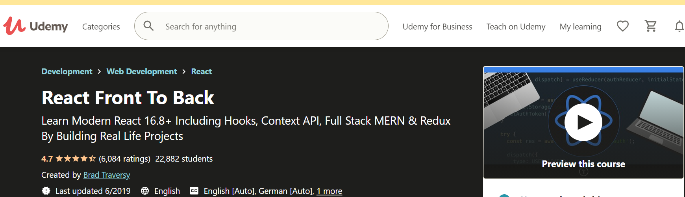

# React

[React - A JavaScript library for building user interfaces](https://reactjs.org/)

[](https://www.youtube.com/watch?v=sBws8MSXN7A)

[](https://www.udemy.com/course/modern-react-front-to-back/). Learn Hooks, Context API, MERN, and Redux

## Notes

Create an app with `npx create-react-app <name> [<location>] --template typescript`. No config required

All starts from `<div id="root"></div>` in the `public/index.html` file and then in the `src/index.tsx` file you find the reference to the root element in the DOM

```tsx
ReactDOM.render(
  <React.StrictMode>
    <App />
  </React.StrictMode>,
  document.getElementById('root')
);
```

In this example `App` is the top level component, i.e. a ts file called `App.tsx`

Note: Always start component names with a capital letter.

React components have no state, use the React Context API for application level state

### Class based components

Extends `React.Component`

Has state (`state` property)

Has lifecycle methosd — e.g. `render()`

### Functional Components (the modern way)

Do not have state unless you have use [hooks](https://reactjs.org/docs/hooks-overview.html)

## Hooks


## Context

https://reactjs.org/docs/context.html

